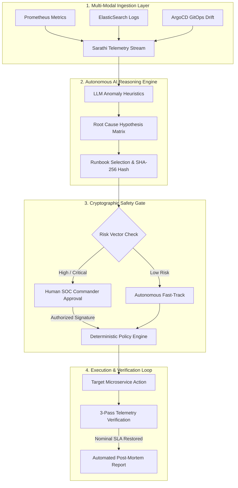

<div align="center">

# 🛡️ SARATHI (सारथी)
### Autonomous SIEM & SRE Incident Response Copilot
**Engineered by Team Hashiras**

[](https://react.dev/)
[](https://fastapi.tiangolo.com/)
[](https://github.com/Athreyasp/sarathi)
[](https://github.com/Athreyasp/sarathi)
[](LICENSE)

<p align="center">
  <b>Sarathi</b> (Sanskrit for <i>The Charioteer / Trusted Guide</i>) is a safety-first autonomous AI incident response platform built for modern <b>Site Reliability Engineering (SRE)</b> and <b>Security Operations Center (SOC)</b> teams.
</p>

[Key Features](#-key-features) • [Architecture](#-system-architecture) • [UI Overview](#-console-views) • [Quick Start](#-getting-started) • [Live Demo](#-live-demo-script) • [Safety Guarantee](#-safety-first-philosophy)

---

</div>

## 🛑 The Core Problem

When critical microservices or payment gateways degrade in production:
* **Manual Triage Latency:** Engineers lose critical minutes manually correlating telemetry across fragmented dashboards (Grafana, ElasticSearch, ArgoCD).
* **High-Risk Remediation:** Blind rollbacks often trigger cascading failures or corrupt database migration schemas.
* **Unconstrained AI Risks:** Granting raw LLM agents direct shell/bash execution permissions in production environments introduces severe security and operational hazards.

---

## ⚡ The Sarathi Solution

**Sarathi** resolves this crisis by establishing a strict boundary between **AI Reasoning** and **Deterministic Execution**:

1. **Ingest & Correlate:** Autonomously streams and aggregates distributed logs, Prometheus metrics, and deployment revisions in real-time.
2. **Diagnose with Confidence:** Leverages fine-tuned LLM heuristics to isolate the exact root cause (e.g., config drift, SSL handshake errors) and outputs a quantitative confidence score.
3. **Formulate Cryptographic Runbooks:** Maps identified anomalies to pre-compiled deterministic runbooks, generating a strict **SHA-256 hash payload**.
4. **Human-in-the-Loop Gating:** Halts execution for critical mutations and demands explicit authorization from a human SOC commander.
5. **Execute & 3-Pass Verify:** Applies the countermeasure through deterministic APIs, continuously monitors telemetry recovery for 3 consecutive intervals, and generates an automated Post-Mortem report.

---

## 🏗️ System Architecture



---

## 🌟 Key Features

* 🚀 **Fast Cyber Preloader:** Cinematic startup sequence powered by **Team Hashiras** with instant system health checks.
* 🧭 **Google Cloud / Material 3 Navigation:** Collapsible navigation drawer with active rounded pill states and status indicators.
* 📊 **Live Telemetry & Anomaly Matrix:** Real-time error rate tracking, P95 latency monitoring, and interactive Area charts.
* 📜 **Full-Screen SIEM Log Terminal:** Searchable event stream with level filtering (`CRITICAL`, `WARN`, `INFO`) and stream pause/resume.
* 🤖 **Autonomous SOC Copilot Console:** Interactive reasoning graph displaying ingestion, hypothesis scoring, and post-mortem generation.
* 🔐 **SHA-256 Runbook Registry:** Library of pre-compiled safety runbooks with a live JSON schema inspector.
* 🌐 **Fleet Infrastructure Topology:** Service node health inspection, container specifications, and microservice dependency mesh.

---

## 🖥️ Console Views

| View | Purpose | Key Capabilities |
| :--- | :--- | :--- |
| **SOC Overview** | Main Triage Hub | 3-panel split view with live stream, error telemetry, and the AI investigator widget. |
| **Telemetry Matrix** | Deep Health Analytics | P95 latency distributions, HTTP 500 spike graphs, and PostgreSQL connection pool gauges. |
| **Live Log Stream** | Log Exploration | Real-time log streamer with sub-second event rendering and keyword search. |
| **AI Investigator** | Copilot Command Center | Full hypothesis breakdown, multi-modal ingestion status, and approval gating. |
| **Security Runbooks** | Cryptographic Library | Inspect JSON schemas for `RB-01` (Rollback), `RB-02` (DB SSL Sync), `RB-03` (Circuit Breaker), and `RB-04` (Vault Secrets). |
| **Fleet Topology** | Microservice Mesh | Live Pod specifications, TLS status, CPU/Memory telemetry, and downstream dependency maps. |

---

## 🏃‍♂️ Getting Started

### Prerequisites
* **Python 3.10+**
* **Node.js 18+** & **npm**
* **PowerShell** (Windows) or **Bash** (Linux/macOS)

---

### Option 1: Automated 1-Click Startup (Recommended)

Run the automated boot sequence from the root directory:

```powershell
.\start.ps1
```

> **Note:** If PowerShell blocks script execution, run `Set-ExecutionPolicy -Scope Process -ExecutionPolicy Bypass` first.

The script automatically sets up virtual environments, installs dependencies, and launches all 3 services:
* 🌐 **Frontend UI:** `http://localhost:5173`
* ⚙️ **Backend SIEM API:** `http://localhost:8000/docs`
* 🧪 **Simulator Microservice:** `http://localhost:8001/docs`

---

### Option 2: Manual Step-by-Step Launch

<details>
<summary><b>Click to expand manual setup instructions</b></summary>

#### 1. Start the Microservice Simulator
```bash
cd simulator
python -m venv venv
.\venv\Scripts\activate      # On Linux/macOS: source venv/bin/activate
pip install -r requirements.txt
uvicorn main:app --port 8001 --reload
```

#### 2. Start the Sarathi Backend API
```bash
cd backend
python -m venv venv
.\venv\Scripts\activate      # On Linux/macOS: source venv/bin/activate
pip install -r requirements.txt
uvicorn app.main:app --port 8000 --reload
```

#### 3. Start the React Frontend
```bash
cd frontend
npm install
npm run dev
```

</details>

---

## 🎬 Live Demo Script

Follow this step-by-step walkthrough during presentations or evaluation:

1. **Launch Console:** Navigate to `http://localhost:5173` to see the **Team Hashiras** startup preloader.
2. **Simulate Production Threat:** Click **Simulate Threat** in the top header.
   - The status changes to `System Compromised`.
   - The real-time telemetry chart spikes to **47% HTTP 500 error rate**.
   - Critical database handshake errors flood the log stream.
3. **Deploy AI Investigator:** Click **Deploy AI Investigator** in the Copilot panel.
   - Watch the agent ingest telemetry and correlate distributed logs.
   - The LLM diagnostic engine outputs: `DB_SSL_MODE Configuration Drift (94% Confidence)`.
4. **Authorize Countermeasure:** Review the formulated runbook and click **Authorize Exact Countermeasure**.
5. **Observe Autonomous Recovery:**
   - The deterministic engine applies `RB-01: Rollback Payload v1.0`.
   - The 3-pass verification loop validates latency stabilization (<100ms).
   - The **Post-Mortem Incident Report** generates automatically.

---

## 🔒 Safety-First Philosophy

```
┌─────────────────────────────────────────────────────────────┐
│                   SARATHI SAFETY GUARANTEE                  │
├─────────────────────────────────────────────────────────────┤
│  1. NO RAW SHELL EXECUTION (Zero LLM subprocess spawn)      │
│  2. CRYPTOGRAPHIC SIGNATURES (SHA-256 payload validation)   │
│  3. MANDATORY HUMAN GATING (Explicit operator authorization)│
│  4. DETERMINISTIC 3-PASS VERIFICATION (Automated SLA proof) │
└─────────────────────────────────────────────────────────────┘
```

---

## 👥 Built by Team Hashiras

* **Athreya S P** — *Lead Architecture & Full-Stack Engineering*
* **Team Hashiras** — *Autonomous SRE & AI Cyber-Defense Innovations*

---

<div align="center">
  <sub>Built for Google Cloud Hackathon 2026 // Domain: Technology & Cybersecurity</sub>
</div>
